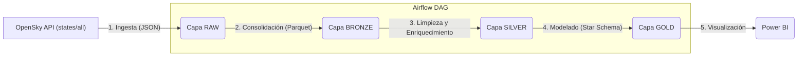

# DSRP-Airflow-Proyecto_Final
Implementación de un a orquestación en Apache Airflow para el curso Airflow de la especialización de Data Engineering del Instituto Data Science Research Peru

# ✈️ Pipeline de Tráfico Aéreo (OpenSky) con Airflow y Arquitectura Medallón

Este proyecto implementa un pipeline de datos ELT (Extract, Load, Transform) de extremo a extremo que ingesta datos de tráfico aéreo en vivo desde la API de **OpenSky Network**, los procesa siguiendo la **Arquitectura Medallón** (Bronce, Silver, Gold) y los modela para ser consumidos por un dashboard en **Power BI**.

El pipeline está completamente orquestado con **Apache Airflow**, utilizando la sintaxis moderna de TaskFlow API (decoradores).

##  Objetivo

El objetivo es capturar snapshots del estado global del tráfico aéreo a intervalos regulares (cada hora) para construir un modelo de datos que permita analizar la información en un dashboard interactivo.

##  Arquitectura

El flujo de datos sigue la Arquitectura Medallón, asegurando la trazabilidad, calidad y reprocesabilidad de los datos.


##  Stack Tecnológico y Herramientas

Este proyecto utiliza un conjunto de herramientas modernas de ingeniería de datos para construir el pipeline de principio a fin:

* **Orquestación y Entorno:**
    * **Apache Airflow:** Utilizado para la orquestación, programación y monitoreo de todo el pipeline. Se implementa la **TaskFlow API** (decoradores `@dag` y `@task`) para una definición de flujos más limpia y moderna.

    * **Docker:** El entorno de Airflow (incluyendo el programador, webserver y workers) se ejecuta en contenedores de Docker, asegurando un entorno de desarrollo consistente, aislado y reproducible.

* **Fuente de Datos:**
    * **OpenSky Network API**: Es la fuente de datos en vivo (endpoint `https://opensky-network.org/api/states/all`) que provee los snapshots de tráfico aéreo global.

* **Procesamiento y Transformación (ELT):**
    * **Python:** Lenguaje principal utilizado para toda la lógica de ingesta y transformación.
    * **Pandas:** Biblioteca clave para la manipulación, limpieza, enriquecimiento y estructuración de los datos en las capas Bronze y Silver.

* **Almacenamiento (Data Lake):**
    * **Apache Parquet:** Formato de almacenamiento columnar elegido para las capas Bronze, Silver y Gold. Es altamente eficiente para consultas analíticas y ofrece alta compresión.

* **Visualización (Business Intelligence):**
    * **Microsoft Power BI:** Herramienta final para conectarse a la Capa Gold (el Esquema Estrella) y construir el dashboard interactivo que visualiza los KPIs y el tráfico en vivo.

#  Guía de Configuración Local 

Esta guía resume las instrucciones para configurar el entorno localmente usando `uv` y Docker.

### Prerrequisitos

Antes de empezar, asegúrate de tener instalado y **corriendo** lo siguiente:
* Visual Studio Code
* Docker Desktop 
* Python 3.11 

---

### Configuración del Entorno Virtual

Sigue estos pasos para crear un espacio de trabajo aislado para tu proyecto.

**Crear Carpeta del Proyecto**
* En tu explorador de archivos, crea la carpeta donde vivirán tus proyectos.

**Abrir VS Code y la Terminal**
* Abre esa carpeta en VS Code (`Archivo > Abrir carpeta...`).
* Abre una nueva terminal de PowerShell (`Terminal > Nueva terminal`).

**Instalar `uv`**
* `uv` es un gestor de entornos virtuales y paquetes de Python. Instálalo ejecutando:
    ```bash
    python -m pip install uv
    ```

**Crear el Entorno Virtual**
* Usa `uv` para crear un entorno virtual (`.venv`) usando Python 3.11:
    ```bash
    uv venv --python 3.11
    ```

**Activar el Entorno Virtual**
* Ejecuta el script de activación. Verás `(.venv)` al inicio de tu línea de comandos:
    ```bash
    .\.venv\Scripts\activate
    ```

**Verificar la Versión de Python**
* Asegúrate de que el entorno esté usando la versión correcta:
    ```bash
    python --version
    ```
    *(Deberías ver `Python 3.11.x`)*

---

### Instalación y Despliegue de Airflow

Ahora que el entorno está listo, instalaremos Airflow y lo iniciaremos.

**Instalar Apache Airflow**
* Dentro de tu entorno activado, usa `uv` para instalar la versión 3.0.0 de Airflow:
    ```bash
    uv pip install -r  .\requirements.txt
    ```

**Levantar los Contenedores de Airflow**
* Este comando leerá tu archivo `docker-compose.yaml` e iniciará Airflow (asegúrate de que Docker Desktop esté corriendo):
    ```bash
    docker-compose up -d
    ```
    *(Este paso puede tardar varios minutos la primera vez. Sabrás que está listo cuando veas muchos logs corriendo en la terminal).*

---

### Verificación del Entorno

**Acceder a la Interfaz Web**
* Abre tu navegador y ve a:
    `http://localhost:8080/`

**Ingresar Credenciales**
* **Usuario:** `airflow`
* **Contraseña:** `airflow`

**Verificar en Docker Desktop**
* Abre la aplicación de Docker Desktop. Deberías ver un nuevo contenedor llamado `airflow-intro` (o similar) en estado "corriendo" (running).
